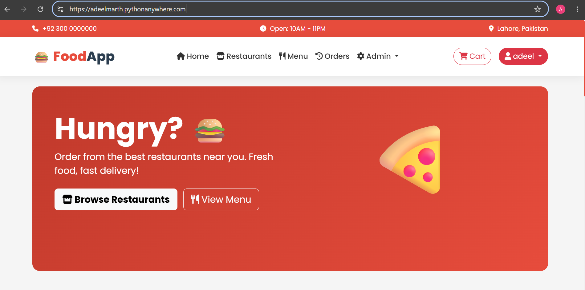
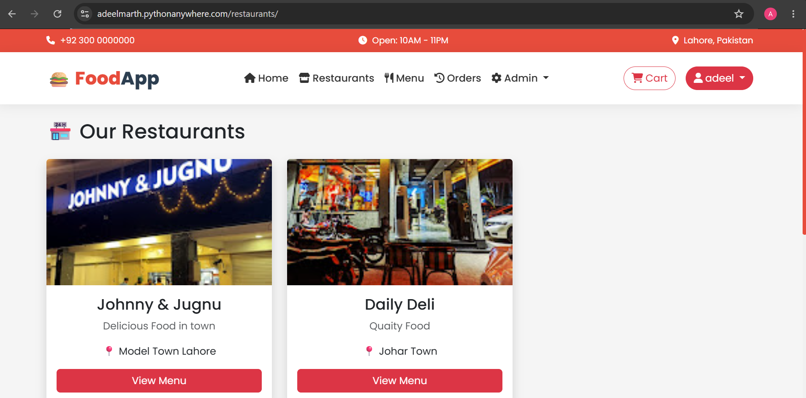
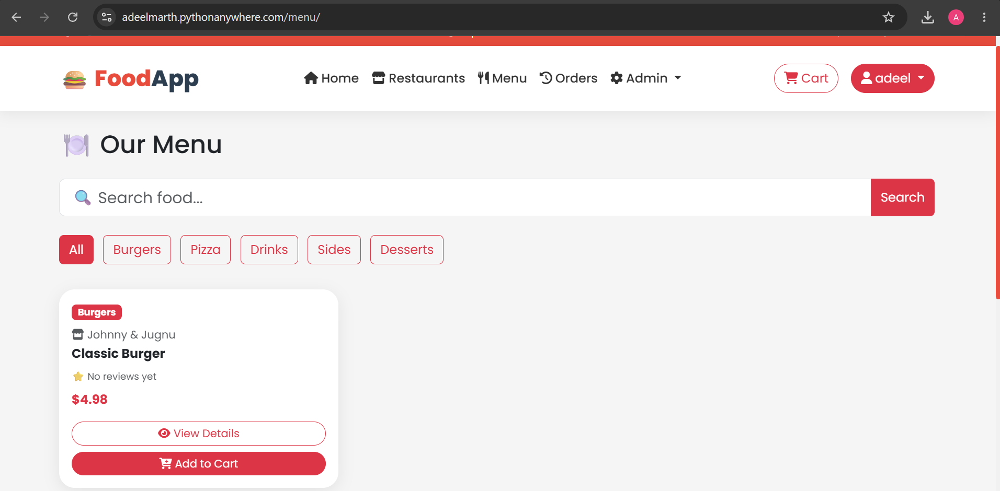
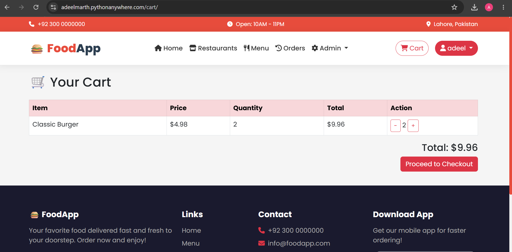
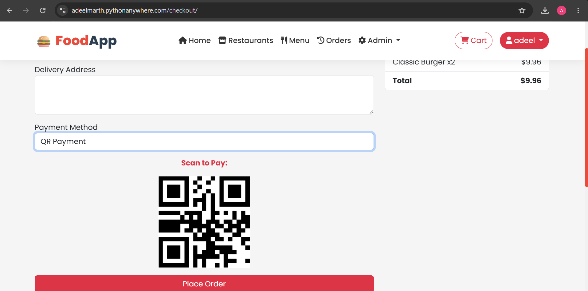
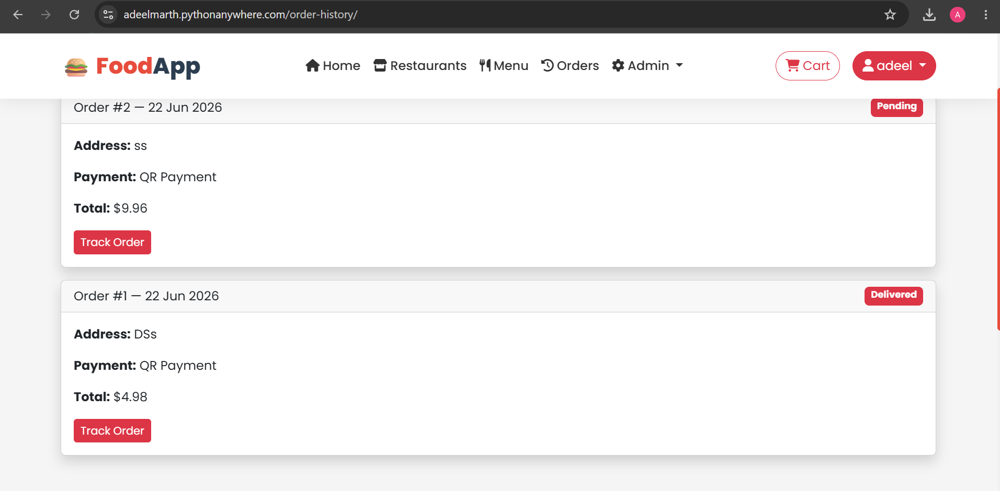

# 🍔 FoodApp — Full-Stack Food Delivery Web App

A complete food ordering and delivery platform built with **Django**, **Bootstrap 5**, and **SQLite**. Users can browse restaurants, explore menus, place orders, and track delivery — all in a clean, responsive interface.

🔗 **Live Demo:** [adeelmarth.pythonanywhere.com](https://adeelmarth.pythonanywhere.com)

-----

## 📸 Screenshots

<!-- Add your screenshots below. Example format: -->

<!--  -->

|Home                         |Restaurants                                |Menu                         |
|-----------------------------|-------------------------------------------|-----------------------------|
||||

|Cart                         |Checkout                             |Order Tracking                       |
|-----------------------------|-------------------------------------|-------------------------------------|
||||

-----

## ✨ Features

- 🔐 **User Authentication** — sign up, log in, manage account
- 🍽️ **Restaurant Browsing** — explore multiple restaurants with category filtering and search
- 🛒 **Shopping Cart** — add/remove items, adjust quantities
- 💳 **Checkout** — Cash on Delivery and QR payment options
- 📦 **Order History** — view past orders
- 🚴 **Live Order Tracking** — rider animation with ETA countdown
- ⭐ **Ratings & Reviews** — rate and review food items
- 📊 **Admin Dashboard** — sales statistics and order management

-----

## 🛠️ Tech Stack

- **Backend:** Django (Python)
- **Frontend:** Bootstrap 5, HTML, CSS, JavaScript
- **Database:** SQLite
- **Deployment:** PythonAnywhere
- **Static Files:** WhiteNoise

-----

## 🚀 Getting Started Locally

```bash
# Clone the repository
git clone https://github.com/marth6916-design/foodapp.git
cd foodapp/backend

# Create and activate a virtual environment
python -m venv venv
source venv/bin/activate   # Windows: venv\Scripts\activate

# Install dependencies
pip install -r requirements.txt

# Run migrations
python manage.py migrate

# Create an admin account
python manage.py createsuperuser

# Start the development server
python manage.py runserver
```

Visit `http://127.0.0.1:8000` in your browser.

-----

## 📁 Project Structure

```
backend/
├── foodapp/          # Main Django app (models, views, templates logic)
├── backend/          # Project settings, URLs, WSGI config
├── templates/        # HTML templates
├── staticfiles/       # Collected static assets
├── Media/            # Uploaded images (restaurant/food photos)
├── manage.py
└── requirements.txt
```

-----

## 👤 Author

**Adeel** — Full-Stack Developer

- GitHub: [@marth6916-design](https://github.com/marth6916-design)

-----

## 📝 License

This project is open source and available for learning purposes.